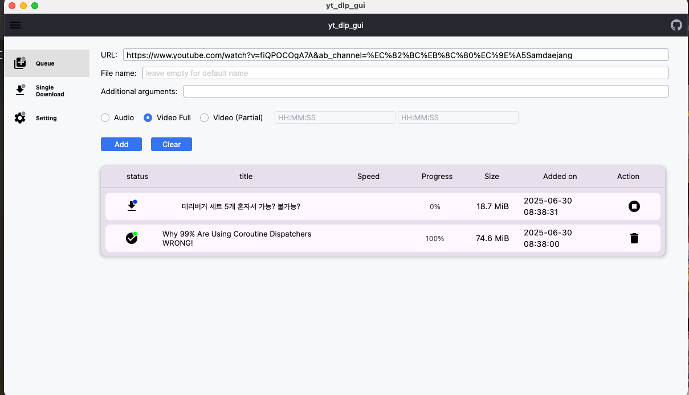
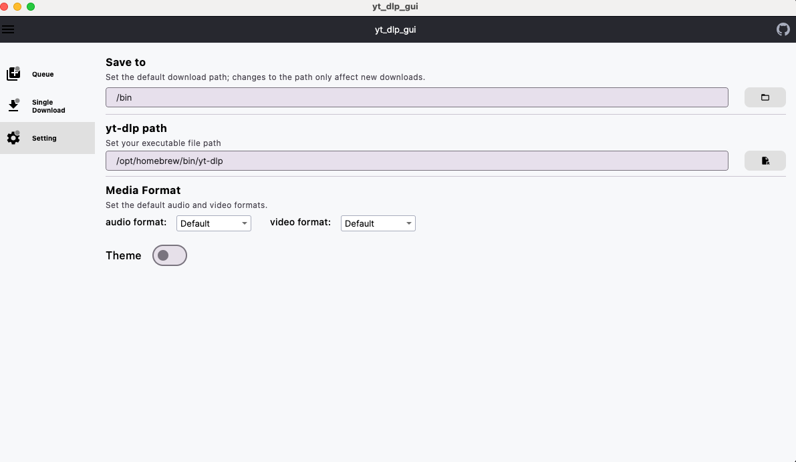

# yt-dlp KMM Desktop GUI


This project is a desktop GUI application for yt-dlp, built on KMM (Kotlin Multiplatform Mobile). It leverages Compose Multiplatform to provide a user-friendly interface that runs on desktop environments.






### 📋 Prerequisites

* **FFmpeg** [FFmpeg](https://github.com/FFmpeg/FFmpeg)
* **Yt-dlp** [yt-dlp](https://github.com/yt-dlp/yt-dlp)

### ⬇️ Download & Install

1.  Go to the **[Releases page](https://github.com/stella6767/yt-dlp-kmm/releases)** of this repository. 
2.  Find the latest release (e.g., `v1.0.0`).
3.  Download the appropriate installer file for your OS:
    * **macOS:** `.dmg` file
4.  Run the installer file and follow the on-screen instructions.


### ⚙️ Build from Source

If you prefer to build the application yourself, follow these steps:

1.  **Clone the Repository:**
    ```bash
    git clone [https://github.com/stella6767/yt-dlp-kmm]
    cd yt-dlp-kmm-gui
    ```

2.  **Run the Desktop Application (Development Mode):**
    ```bash
    ./gradlew run
    ```
    Alternatively, open the `MainKt` file in IntelliJ IDEA and click the run button.

3.  **Generate Native Distribution Files (Windows, macOS, Linux):**
    Generate installer files for various operating systems. The generated files can typically be found in the `build/compose/binaries` or `build/compose/distributions` directory.

    * **macOS (`.dmg`):**
        ```bash
        ./gradlew :composeApp:packageDmg
        ```
    * **Windows (`.msi`):**
        ```bash
        ./gradlew :composeApp:packageMsi
        ```
    * **Linux (`.deb`):**
        ```bash
        ./gradlew :composeApp:packageDeb
        ```

---

## ✨ Key Technologies

This project is developed using the following technology stack:

* **Kotlin Multiplatform:** Enables sharing a single codebase across multiple platforms.
* **Koin:** A dependency injection (DI) framework that helps in writing modular and testable code.
* **Kotlinx Coroutines:** A library for asynchronous programming.
* **Jetpack Lifecycle:** Manages the lifecycle of components.

---

## ✍️ Contributing

Contributions are welcome! You can participate by submitting bug reports, feature suggestions, or pull requests.


## 📜 참고

https://slack-chats.kotlinlang.org/t/22708259/am-i-right-to-find-that-the-default-sizes-of-compose-3-widge
https://www.jetbrains.com/help/kotlin-multiplatform-dev/multiplatform-samples.html
https://dev.to/coltonidle/compose-for-desktop-app-size-comparison-3d8h
https://www.youtube.com/watch?v=GzQ4VNjFnRY&ab_channel=Stevdza-San
https://proandroiddev.com/best-practices-for-composition-patterns-in-jetpack-compose-39676ffcc933
https://www.yes24.com/product/goods/117865901
https://developer.android.com/develop/ui/compose/custom-modifiers
https://www.jetbrains.com/help/kotlin-multiplatform-dev/compose-drag-drop.html#what-s-next
https://dev.to/tkuenneth/from-swing-to-compose-desktop-3-23ck
https://github.com/marcopiovanello/yt-dlp-web-ui
https://github.com/mhogomchungu/media-downloader/
https://docs.github.com/ko/communities/setting-up-your-project-for-healthy-contributions/adding-a-license-to-a-repository
https://developer.android.com/topic/architecture/recommendations
https://github.com/JetBrains/compose-multiplatform/issues/4883
